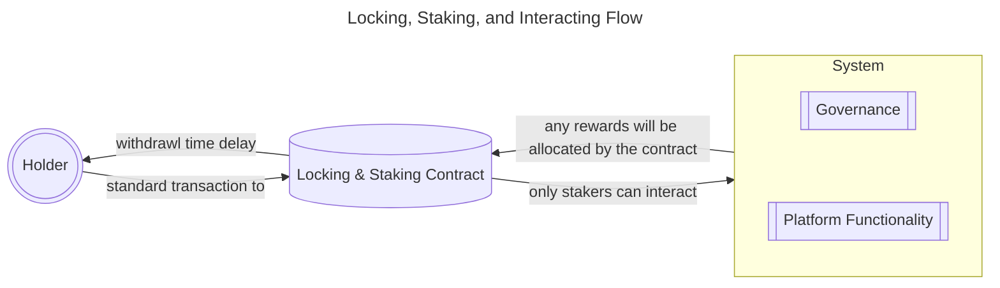
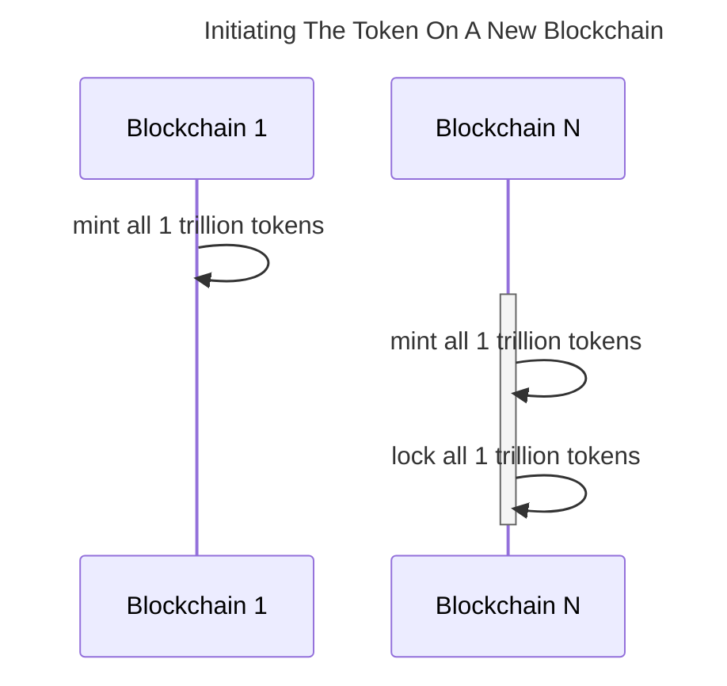
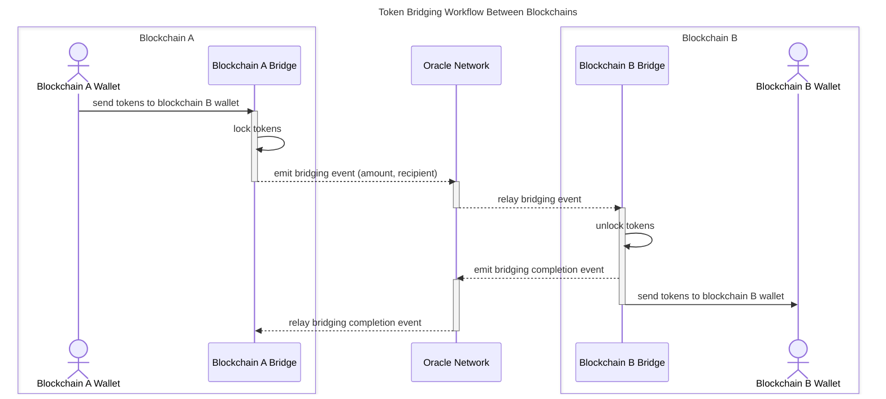
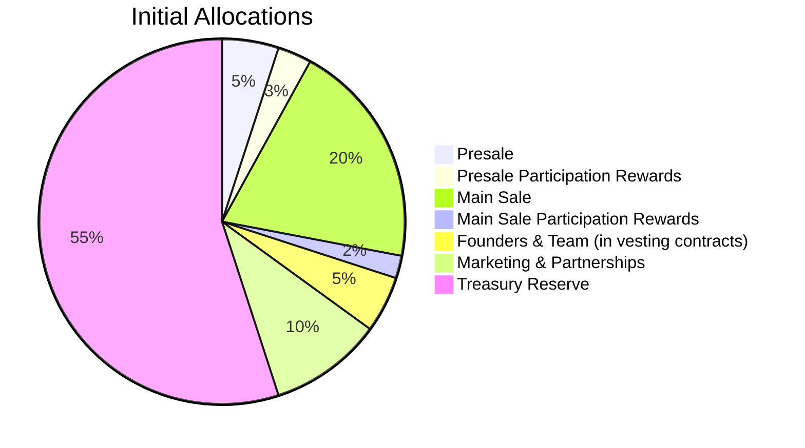
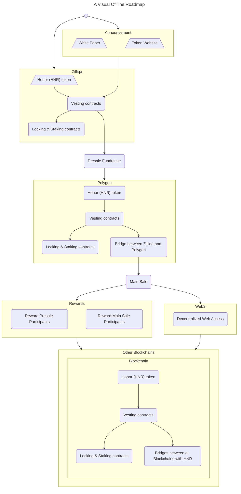

# Honor (HNR) Token

```BibTeX
@misc{ whitepaper,
   title        = {Honor (HNR) Token},
   note         = {Whitepaper},
   author       = {Andrew D Pankow, MFA, DRA},
   year         = {2024},
   month        = {dec},
   organization = {Honoring Life Inc},
   url          = {https://token.honoring.life},
   edition      = {1.0.0},
   howpublished = {Online at \url{https://token.honoring.life/documents/whitepaper-1_0_0.pdf}},
}
```


## Utility & Governance

At Honoring Life, we believe every memory and milestone deserves to be preserved, so nothing and no one is forgotten. Our mission is to ensure the stories of all-that-has-been remain timeless and accessible, safeguarding them for generations to come.

Participation should be fun, fair, for the people, of the people, and by the people.

To power a secure, sustainable, and participatory ecosystem, Honor (HNR) token offers:

- **Industry Standards** : Per blockchain, chain-standard token
- **Locking & Staking**  : Collateralize to ensure serious, fair engagement
- **Utility**            : Creation, collaboration, cooperation, and more
- **Governance**         : Decentralized Autonomous Organization (DAO) enabling user-driven improvements
- **Rewards**            : Participation-based gratuity mechanisms

Honor (HNR) tokens do not constitute securities and are intended for utility and governance within the Honoring Life ecosystem. They allow you to preserve digital memorials that generations can cherish, with the security of blockchain ensuring their permanence.

With a total supply of 1 trillion tokens, Honor (HNR) is accessible to all with its value rooted in purpose and accountability.

## Table of Contents

- [Utility & Governance](#utility--governance)
- [Introduction](#introduction)
   - [Quick Disclaimers](#quick-disclaimers)
   - [Problem Statements](#problem-statements)
   - [The Team](#the-team)
- [Locking & Staking](#locking--staking)
   - [Purpose](#purpose)
   - [Mechanics](#mechanics)
- [Bridging](#bridging)
   - [Purpose](#purpose-1)
   - [Mechanics](#mechanics-1)
      - [Risks](#risks)
- [Tokenomics](#tokenomics)
   - [Supply](#supply)
      - [Initial Allocations](#initial-allocations)
   - [How To Acquire Tokens](#how-to-acquire-tokens)
   - [Treasury Reserve](#treasury-reserve)
   - [Vesting](#vesting)
      - [Purpose](#purpose-2)
      - [Mechanics](#mechanics-2)
      - [Values](#values)
      - [Affectors](#affectors)
   - [Presale Fundraiser](#presale-fundraiser)
      - [Purpose](#purpose-3)
      - [Mechanics](#mechanics-3)
      - [Values](#values-1)
      - [Refund](#refund)
   - [Main Sale](#main-sale)
      - [Purpose](#purpose-4)
      - [Mechanics](#mechanics-4)
      - [Values](#values-2)
      - [Refund](#refund-1)
   - [Sale Participation Rewards](#sale-participation-rewards)
      - [Purpose](#purpose-5)
      - [Mechanics](#mechanics-5)
      - [Values](#values-3)
         - [Base Rewards](#base-rewards)
         - [Responsive Multiplier](#responsive-multiplier)
            - [Example 1: Participant Holds All Tokens Purchased](#example-1-participant-holds-all-tokens-purchased)
            - [Example 2: Participant Uses Or Sells Half Their Tokens](#example-2-participant-uses-or-sells-half-their-tokens)
            - [Example 3: Participant Acquires More Tokens After Sale](#example-3-participant-acquires-more-tokens-after-sale)
         - [Adjusted Rewards](#adjusted-rewards)
      - [Presale Participation Rewards](#presale-participation-rewards)
      - [Main Sale Participation Rewards](#main-sale-participation-rewards)
- [The Token's Roadmap](#the-tokens-roadmap)
- [Be Honorable](#be-honorable)
- [Appendix](#appendix)
   - [Solidity: Honor (HNR) Token](#solidity-honor-hnr-token)
   - [ES6: Vesting Simulator](#es6-vesting-simulator)
      - [Vesting Simulation](#vesting-simulation)
   - [ES6: Sale Rewards Simulator](#es6-sale-rewards-simulator)
      - [Sale Rewards Simulation](#sale-rewards-simulation)
   - [Glossary](#glossary)

## Introduction

Eternalizing Memories, Empowering Legacies

Honoring Life Inc was formed to legally support those who would architect the future of legacies. Our platform empowers users to honor lives, preserve legacies, and shape the platform's future by participating in a vibrant, user-driven ecosystem.

Through the Honor (HNR) token, users not only engage in activities like content creation and collaboration but also drive meaningful governance decisions, ensuring that the Honoring Life platform evolves with fairness, security, and transparency.

### Quick Disclaimers

As implied by the version number being present on this whitepaper, updates to this document are inevitable.

This whitepaper is for informational purposes only and does not constitute financial, investment, or legal advice. Honor (HNR) tokens are not securities and do not grant ownership or equity in Honoring Life Inc.

### Problem Statements

- People need to be incentivized to return to a platform and appropriately interact with it.
- People want to use the blockchain of their choice.
- Web3 platforms and their governances should be rewarded for their dedication.
- Web3 platforms need to outlive their original, centralized governances.
- Treasuries must be self-sustaining without minting.
- If systems cost a base fee, common trolls and bots will be dissuaded.
- If bad actors are allowed to pump and dump, the community loses trust in the token.
- There need to be costs for being wrong or malicious.

See [Contract](./contracts/HNRToken.sol) for Token Code

### The Team

Currently, Honoring Life Inc. is driven by a single individual committed to creating a meaningful platform that empowers users to honor lives and preserve legacies. However, this journey would not have been possible without the support and inspiration of my family and loved ones:

- my wife and children for their daily patience and support
- my mother for her help in translating this new tech for older generations
- my great aunt and great uncle for inspiring me to create this project with their passing
- my father for inspiring me to complete this project with his own passing

As the project evolves, the team is expected to grow, embracing diverse talents to further Honoring Life's mission.

## Locking & Staking

### Purpose

By staking tokens, users gain exclusive access to platform features, driving collaboration and innovation.

Locking and staking ensures that users are committed to the ecosystem, creating a layer of accountability and fairness. By requiring users to lock tokens to participate, Honor (HNR) token discourages speculative or malicious behavior. 

From a user's locked amount, that user can then stake tokens to various participation and governance actions such as proposals and voting. Based on the interaction, there may be rewards, stalemates, and/or losses. This provides both added security from bad actors and incentive to use the system.

### Mechanics

- Users lock Honor (HNR) tokens in their vault
- Users can withdraw any amount of their locked tokens
	- Withdrawals incur a time delay to prevent rapid entry/exit manipulation
- Users can stake some amount of locked tokens to:
	- Gain access to platform current and future features
	- Participate in platform activities
	- Participate in governance decisions
	- Earn through engagement
- Should participation be favorable or successful, the user may be rewarded
- Should participation be unfavorable or unsuccessful, the user may lose their staked amount
- Users can lock their rewards in their vault
- Users can withdraw their rewards with withdrawal delays



## Bridging

### Purpose

Bridging lets you move assets between blockchains.

Our initial launch will take place on Zilliqa due to its ease of use, speed, low transaction costs, and vibrant community. Zilliqa has been a pioneer in the area of sharding technology which provides high throughput and scalability, enabling smooth transactions even as the ecosystem grows.

However, we recognize that blockchain ecosystems are dynamic, with communities and technologies evolving over time. People, communities, and projects may grow, move, or exist across multiple chains simultaneously.

We aim to host and support anyone who wants to join our journey and maintain a nearly eternal platform. Honor (HNR) token's bridging systems enable seamless movement of tokens between blockchains without requiring exchanges or cumbersome processes such as burning and re-minting. This streamlined approach makes the platform more user-friendly, minimizes risks, and provides flexibility for our community to adapt to the ever-changing blockchain landscape.

### Mechanics

To start:

1) Each chain will have minted the full total supply of tokens
2) On chains after the first, the full total supply of tokens will immediately be locked in the bridging contract




Sending from Blockchain-A::Address to Blockchain-B::Address:
1. The starting address sends tokens via the Bridges
2. Blockchain A Bridge locks the token amount
3. Blockchain A Bridge emits the bridging event
4. The Oracle relays the bridging event to Blockchain B Bridge
5. Blockchain B Bridge unlocks the token amount
6. Blockchain B Bridge emits bridging completion event
7. Blockchain B Bridge transfers the token amount to the destination address
8. The Oracle relays the bridging completion event



#### Risks

Most blockchains cannot communicate outside of themselves; they are primarily a ledger of transactions. In order to communicate between chains, a third-party is required.

Centralized systems are a risk to sustainability because they can be turned off for. For this reason, we're opting for the Oracle paradigm which allows decentralization of data and enables interchain secure and verifiable communication. However, this paradigm comes with the potential for delays as Oracles are networks themselves and need to come to consensus about entries before further action takes place. 

Setting and updating Oracles for each bridge will be possible and determined by the governance in place. This will allow for the mitigation of any future vulnerabilities.

## Tokenomics

### Supply

1,000,000,000,000 (1 Trillion) Honor (HNR) tokens (18 decimals)

#### Initial Allocations

| Beneficiary                     | Allocation                    | Percent |
| ---                             | ---                           | ---     |
| Presale                         |  50,000,000,000  (50 Billion) |      5% |
| Presale Participation Rewards   |  30,000,000,000  (30 Billion) |      3% |
| Main Sale                       | 200,000,000,000 (200 Billion) |     20% |
| Main Sale Participation Rewards |  20,000,000,000  (20 Billion) |      2% |
| Founders & Team                 |  50,000,000,000  (50 Billion) |      5% |
| Marketing & Partnerships        | 100,000,000,000 (100 Billion) |     10% |
| Treasury Reserve                | 550,000,000,000 (550 Billion) |     55% |



### How To Acquire Tokens

We've designed the Honor (HNR) token distribution to encourage meaningful engagement, reward active participants, and ensure the ecosystem grows sustainably. By providing clear incentives for locking, staking, and governance, the Honoring Life platform empowers users to shape its future.

- **Purchases & Swaps**
	- Tokens will be available for purchase through public sales
	- Users will eventually be able to acquire tokens through exchanges, ensuring accessibility to all
      - The value of Honor (HNR) tokens may fluctuate due to market conditions, and participation in staking or governance involves inherent risks.
- **Participation Incentives**
	- Locking tokens and contributing to platform governance and activities may earn rewards
	- This can incentivize active participation and long-term commitment to the ecosystem
- **Governance Incentives**
	- Token holders who actively engage in decision-making (e.g., voting on proposals) may receive rewards to encourage continued involvement in shaping the Honoring Life platform
- **Marketing & Rewards**
	- To onboard and engage new users, we may distribute tokens as promotional rewards to early adopters and active community members
   - Rewards from our ecosystem may come in the form of Airdrops or Claimables

### Treasury Reserve

The Treasury Reserve is a cornerstone of the Honoring Life ecosystem's sustainability, providing flexibility for future needs. While it has no pre-defined use cases, potential applications include:

- **Liquidity Pools** : Establishing token liquidity on exchanges or future sales.

This reserve allows us to adapt to evolving requirements while maintaining a secure and self-sustaining ecosystem. Usage will align with the platform's mission and, ultimately, be subject to governance approval.

### Vesting

#### Purpose

This is a trust-building measure designed to protect the community and ensure fair participation by preventing rapid and unfair value manipulation. Additionally, vesting reinforces the team's commitment to the project, ensuring they remain dedicated to its long-term success and development.

#### Mechanics

Vesting with a Cliff

1. The allocated tokens will be held in the contracts
2. After a waiting period of time (the cliff), the tokens will then start their vesting schedule
3. The contract will release the tokens to their beneficiary in regular and predictable intervals

Parameters

- **Promise Amount**    : Total awarded at the end of a successful vest
- **Beneficiary**       : The address receiving the tokens
- **Cliff Period**      : The wait time before vesting begins
- **Vesting Period**    : The total duration over which all tokens are fully vested
- **Release Frequency** : Tokens are distributed in regular increments during the vesting period
	- eg. "Quarterly" (token releasing would happen roughly every 7,776,000 seconds)
	- eg. "Annually" (token releasing would happen roughly every 31,536,000 seconds)
- **Start Date**        : The date when the cliff period begins
- **Affectors**         : Events that alter parameters

#### Values

```math
V(t) = \left\lbrace
   \begin{matrix}
      0 & \text{if } t < T_{start} + T_{cliff} \\

      \left\lfloor \frac{t - T_{start}}{T_{freq}} \right\rfloor \cdot Q_{step} & \text{if } T_{start} + T_{cliff} \leq t < T_{start} + T_{vesting} \\
      
      Q_{total} & \text{if } t \geq T_{start} + T_{vesting} \text{ or "Change of Contract Ownership" event}
   \end{matrix}
\right.
```

> If the current time t is before the cliff ends, no tokens are released; after the cliff, tokens are released incrementally at regular intervals (Q_step) until the vesting period ends. Once the vesting period is complete or a "Change of Contract Ownership" event occurs, all remaining tokens are released to the beneficiary. See the table below for variable definitions.

Where:

| Symbol                                        | Meaning                                                |
| ---                                           | ---                                                    |
| $V\left(t\right)$                             | Total tokens vested to the beneficiary                 |
| $Q_{total}$                                   | Total tokens promised to the beneficiary               |
| $t$                                           | The current timestamp (Unix Epoch)                     |
| $T_{start}$                                   | Start date of the Cliff period (Unix Epoch)            |
| $T_{cliff}$                                   | Cliff period duration in seconds                       |
| $T_{vesting}$                                 | Vesting period duration in seconds                     |
| $T_{freq}$                                    | Duration of each release frequency interval in seconds |
| $Q_{step} = \frac{Q_{total}}{N_{steps}}$      | The number of tokens released at each step             |
| $N_{steps} = \frac{T_{vesting}}{T_{freq}}$    | Total number of steps in the vesting period            |

#### Affectors

Vesting is designed to ensure trust and fairness, but certain events may necessitate modifications to vesting contracts. These might include:

- **Cancellations/Refunds**
	- Before the Vesting Period Ends: If the vesting contract is canceled, all unvested tokens are refunded or redistributed.
	- After the Vesting Period Ends: Fully vested tokens remain with the beneficiary, but any unclaimed tokens may be redistributed.
- **Change of Contract Ownership**
	- If the ownership of the contract changes before the end of the vesting period, all unvested tokens are released immediately to the beneficiary.
- **Adding to the Vesting Amount**
	- Additional tokens can be added to an ongoing vesting contract, extending the total allocation and possibly the vesting period.
- **Reducing the Vesting Amount**
	- Tokens allocated to the vesting contract can be reduced, provided the beneficiary agrees to the reduction or certain conditions are met.

These affectors provide flexibility while preserving fairness, ensuring vesting aligns with evolving needs or unexpected changes.

### Presale Fundraiser

#### Purpose

This presale round is to fuel the development of the Honoring Life platform and the token environment. The presale sets a foundational price that reflects early adopter enthusiasm and community trust.

#### Mechanics

Pool Funding

1. The fundraiser contract will be loaded with a certain amount of the Honor (HNR) token.
2. Participants will fund the contract with their contributions
3. On completion, participants will achieve their portion of the Honor (HNR) tokens based on their contribution size vs the total contributions
4. The achieved amounts will be vested and released to the holder

Parameters

- **Minimum Pool Requirement** : Amount that must be raised for the sale to succeed
- **Sale Duration**            : A fixed time period
- **Maximum Contribution**     : Naive whale prevention

#### Values

```math
T_{ total,i } = { C_{ i } \over C_{ total } } * T_{ allocation }
```

> The amount of tokens purchased by an individual is equal their contribution relative to all participants' contributions multiplied by the allocated quantity of tokens

```math
P = { C_{ total } \over T_{ allocation } }
```

> Price discovery per token will be all participants' contributions relative to the allocated quantity of tokens

Where:

| Symbol           | Meaning                                  |
| ---              | ---                                      |
| $T_{total,i}$    | An individual participant's total tokens |
| $C_{i}$          | An individual participant's contribution |
| $C_{total}$      | Sum total of all contributions           |
| $T_{allocation}$ | Total tokens allocated to the sale       |
| $P$              | Price per token                          |

#### Refund

Same as the [main sale's refund](#refund-1)

If the fundraiser fails to meet its minimum pool requirement, the contract will automatically return contributions to participants in full, excluding any blockchain processing fees. This ensures that no funds are held if the fundraiser does not achieve the minimum viability threshold. Should this occur, the fundraiser will be redesigned and rescheduled based on community feedback to better align with participant needs.

### Main Sale

#### Purpose

This sale provides:

| Recipient | Percent | Purpose |
| --- | --- | --- |
| Honoring Life Inc | 60% | Covers operational and legal costs, platform development, salaries, and general expenses necessary for platform growth |
| Liquidity Provisions | 40% | Allocated to provide liquidity on exchanges to stabilize the token price post-sale |

#### Mechanics

The main sale introduces a markup percent based on the price discovered during the presale. This markup ensures fairness to presale participants while reflecting increased demand and development progress. It incentivizes early adoption and acknowledges the evolving value of the token as the ecosystem matures.

Direct Purchase

1. The fundraiser contract will be loaded with a certain amount of the Honor (HNR) token
2. Participants will create a new vesting contract with every purchase
3. On completion, tokens not sold at the end of the sale will be returned to the Liquidity Reserves

Parameters

- **Markup Percent**:   The ratio that a token is sold for compared to the price discovery of the presale
- **Sale Duration**:    A fixed time period
- **Maximum Purchase**: Naive whale prevention

#### Values

```math
P = P_{ presale } * M_{ markup }
```
> Using the price-per-token value discovered in the Pre-Sale, the tokens will be marked up and sold at this fixed cost.

Where:

| Symbol        | Meaning                        |
| ---           | ---                            |
| $P$           | Price per token                |
| $P_{presale}$ | Presale price per token        |
| $M_{markup}$  | Percent marked up from presale |

#### Refund

Types:

- **Simple Refund**    : Requesting a refund prior to receiving vested tokens
   1. Vesting contract will be canceled
   2. Refund will be issued
- **Sell-Back Refund** : Refunds revert entire transactions; no partial refunds
   1. Customer returns the exact quantity of tokens from a purchase transaction
   2. Refund will be issued
- **Compound Refund**  :  Requesting a refund after tokens have vested but vesting period is ongoing
   1. Vesting contract will be canceled
   2. Refund will be issued only for the unvested tokens
   3. Requires Sell-Back Refunds for all vested tokens per vesting release

Refunds are only possible during the sale and vesting periods; after which refunds will not be possible. 

Processing fees (including gas) will be deducted from refunds.

### Sale Participation Rewards

Supporting a project early deserves recognition. To reward early adopters, participation rewards provide extra tokens based on how many tokens a participant holds compared to what they purchased during the sale.

The system is designed to encourage commitment and reduce speculative behavior. By holding onto your tokens, you're eligible for greater rewards. 

Here's how it works:

1. **Base Rewards**          : Everyone gets a base reward proportional to their purchase.
2. **Responsive Multiplier** : Rewards increase if you hold all or most of your purchased tokens.
   - If you hold fewer tokens, your rewards decrease to reflect reduced commitment.
3. **Adjusted Rewards**      : Final rewards are adjusted to ensure total allocations are distributed fairly.

#### Purpose

Participants should be extra rewarded for their support of the program in the early stages.

#### Mechanics

Adjusted Multiplier

1. The rewards contract will be loaded with a certain amount of the Honor (HNR) token
2. The contract will vest
3. An adjusted multiplier accounts for the participant's current balance amount compared to their purchase
4. The participant receives their share of the rewards based on the adjusted multiplier

#### Values

##### Base Rewards

Parameters:
- **Total Allocation** : The quantity of tokens for rewards
- **Participants**     : The list of addresses with purchase quantity and current holdings

```math
T_{ base reward,i } = { T_{ purchased,i } \over T_{ sold } } * T_{ allocated }
```

Where:

| Symbol                                      | Meaning                                     |
| ---                                         | ---                                         |
| $T_{allocated}$                             | Total allocated rewards                     |
| $T_{purchased,i}$                           | Tokens purchased by participant $i$         |
| $T_{sold} = \sum_{i=\text{first participant}}^{\text{last participant}} T_{purchased,i}$ | Total tokens sold across all participants  |

##### Responsive Multiplier

The responsive multiplier applies penalties to rewards based on a participant's balance-to-purchase ratio, with higher penalties applied to lower ratios.

Extra Parameter
- **Penalty Exponent** : The amplitude of the adjustment

Rewards can be scaled by the ratio of current holdings by the amount purchased in the sale but capped at a ratio no larger than 1:1 and then amplified by a penalty exponent.

```math
F_{ responsive,i } = min \left ( { T_{ balance,i } \over T_{ purchased,i } }, 1.0 \right ) ^ { F_{ penalty } }
```

Where:

| Symbol               | Meaning                                   |
| ---                  | ---                                       |
| $F_{ responsive,i }$ | The adjustment factor for participant $i$ |
| $T_{ balance,i }$    | Tokens currently held by participant $i$  |
| $F_{ purchased,i }$  | Tokens purchased by participant $i$       |
| $F_{ penalty }$      | The penalty exponent                      |

###### Example 1: Participant Holds All Tokens Purchased

If you purchase 1,000 tokens and still hold 1,000 tokens when rewards are distributed, you'll get the full reward you're eligible for.

###### Example 2: Participant Uses Or Sells Half Their Tokens

**Scenario**: Participant purchases 1,000 tokens but whose balance is only 500 tokens at the time of reward distribution.

- **Balance Ratio**:         $min( { 500 \over 1000 }, 1 ) = { 500 \over 1000 }$ = 0.5
- **Penalty Exponent**:      2
- **Responsive Multiplier**: 0.5² = 0.25

**Outcome**: The participant's reward is reduced to 25% of the base reward, reflecting their reduced commitment to the ecosystem.

###### Example 3: Participant Acquires More Tokens After Sale

**Scenario**: Participant purchases 1,000 tokens but whose balance is 1,500 tokens at the time of reward distribution.

- **Balance Ratio**:         $min( { 1500 \over 1000 }, 1 ) = { 1000 \over 1000 }$ = 1.0 (maximum ratio, no penalty applied)
- **Penalty Exponent**:      2
- **Responsive Multiplier**: 1.0² = 1.0

**Outcome**: The participant's reward is reduced to 25% of the base reward, reflecting their reduced commitment to the ecosystem.

##### Adjusted Rewards

In order to prevent refunds of unrewarded tokens back to the treasury reserve, we're going to normalize all of the rewards so that the total payout matches the total allocation.

```math
F_{normalization} = \left( 
    \frac{T_{allocated}}{\sum_{i=\text{first participant}}^{\text{last participant}} \left( T_{base\ reward,i} \cdot F_{penalty} \right)} 
\right)
```

Where:

| Symbol                | Meaning                                               |
| ---                   | ---                                                   |
| $F_{ normalization }$ | The revised adjustment factor for all participants    |
| $T_{ allocated }$     | Total allocated rewards                               |
| $T_{base\ reward,i}$  | The baseline for the reward earned by participant $i$ |
| $F_{ penalty }$       | The penalty exponent                                  |

Putting it all together:

```math
T_{ reward , i } = T_{ base reward,i } * F_{ responsive,i } * F_{ normalization }
```

> Rewards are calculated as the normalization of the product of a base reward by a responsive multiplier

Where:

| Symbol                | Meaning                                               |
| ---                   | ---                                                   |
| $T_{ reward , i }$    | The revised adjustment factor for all participants    |
| $T_{base\ reward,i}$  | The baseline for the reward earned by participant $i$ |
| $F_{ responsive,i }$  | The adjustment factor for participant $i$             |
| $F_{ normalization }$ | The revised adjustment factor for all participants    |


See JavaScript [Reward Simulator](./scripts/simulations/vestingSimulator.js) and [Reward Simulation](./scripts/simulations/vestingSimulation.js).

#### Presale Participation Rewards

Rewards to the presale participants are as described in the before-mentioned algorithm.

#### Main Sale Participation Rewards

In determining the rewards for the main sale, we must check if the participants have a balance of their main sale tokens compared to their presale tokens.

```math
T_{balance,i} = \left\lbrace \begin{matrix} 
   T_{balance,i} - T_{presale\ purchase,i} & \text{if participated in the presale} \\

   T_{balance,i} & \text{if did not participate in the presale}
\end{matrix} \right.
```

> Since, obviously, the main sale takes place after the presale, we'll need to remove any presale purchase amount from the participant's current balance parameter.

Where:

| Symbol                    | Meaning                                           |
| ---                       | ---                                               |
| $T_{balance,i}$           | Tokens currently held by participant {i}          |
| $T_{presale\ purchase,i}$ | Total tokens participant purchased in the presale |

## The Token's Roadmap
1. Announcement
   1. This whitepaper
   2. Token Website
2. Zilliqa
   1. Launch Honor (HNR) token as an ERC20 token on Zilliqa
   2. Vesting contracts on Zilliqa
   3. Locking & Staking contracts on Zilliqa
2. Presale Fundraiser
3. Polygon
   1. Launch Honor (HNR) token as an ERC20 token on Polygon
   2. Vesting contracts on Polygon
   3. Locking & Staking contracts on Polygon
   4. Bridge between Zilliqa and Polygon
4. Main Sale
5. Early Rewards
   1. Presale Participants who have a current balance of Honor (HNR) tokens
   2. Main Sale Participants who have a current balance of Honor (HNR) tokens         
6. Web3
   1. Decentralized Web Access
7. Other Blockchains
   - {Blockchain}
      1. Launch Honor (HNR) token as a token on {Blockchain}
      2. Vesting contracts on {Blockchain}
      3. Locking & Staking contracts on {Blockchain}
      4. Bridging between all Blockchains with Honor (HNR) tokens



## Be Honorable

Honor (HNR) represents the foundation of a sustainable and enduring ecosystem where memories are preserved, legacies are honored, and communities thrive. Designed with fairness, transparency, and purpose at its core, this token powers an evolving platform that grows with its participants.

Honoring Life is not a fleeting moment but a continuous journey — a platform built to last, where every contribution helps shape a secure and vibrant future. Whether through governance, collaboration, or meaningful engagement, your involvement ensures that this ecosystem remains robust, inclusive, and enduring.

We invite you to join this growing community, where honoring the past and empowering the future go hand in hand. With Honor (HNR), you're not just participating — you're helping build a platform designed to outlast us all.

Be Part of the Journey

- Explore the token: [https://token.honoring.life](https://token.honoring.life)
- Participate in the platform: [https://honoring.life](https://honoring.life)
- Access our web3 dApp (coming soon) via our web3 domain: [honoringlife.crypto](honoringlife.crypto)
- Join the presale and participate in the ecosystem's growth: Details coming soon!
- Contact us at and follow us for the latest updates:
   - Twitter/X: [@honoring_life](https://x.com/Honoring_Life)
   - LinkedIn: [@Honoring Life, Inc](https://www.linkedin.com/company/honoring-life/)

Together, we are creating an everlasting ecosystem where purpose meets progress. Let's honor lives, empower legacies, and build something that truly stands the test of time.

### Glossary

| Term | Definition |
| --- | --- |
| Airdrops | Some assets permitted to different entities can be directly transferred to new owners if allowed by traditional regulatory bodies. |
| Blockchain | A decentralized digital ledger that records transactions across a network of computers. Think of it as a secure but public-owned database. |
| Claimables | Some assets permitted to different entities must be acquired through an intentional action by the new owner due to regulatory requirements. |
| Decentralized Autonomous Organization (DAO) | A community-driven organization where decisions are made collectively, often through voting. |
| Liquidity Pool | A reserve of tokens used to facilitate acquisition on exchanges. It ensures there are always tokens available for current and potential users. |
| Main Sale | The public sale of tokens after the presale, often at a higher price to reflect demand and progress in development. |
| Markup Percent | The increase in price for tokens sold during the main sale compared to the presale. This reflects the token's growing value and demand. |
| Oracle | A decentralized network that records and verifies offchain data and communicates specified events to specified blockchains. |
| Penalty Exponent | A mathematical factor that reduces additional rewards for participants who don't maintain their balance of tokens. |
| Presale | An early fundraising event where participants can buy tokens at a discounted and demand-driven price before they're publicly available. |
| Responsive Multiplier | A reward adjustment system that applies the penalty exponent to base rewards in order to determine a fair distribution of rewards for loyalty to the ecosystem. |
| Sharding | A parallelization mechanism that allows transactions to be recorded at the same time by splitting the network into independent branches and merging them back together when appropriate. |
| Staking | Locking your tokens in the system to gain access to features, participate in activities, or earn rewards. It shows your commitment to the ecosystem. |
| Token | A digital asset that represents ownership, value, identity, utility, and more on a blockchain. Honor (HNR) is our token. |
| Treasury Reserve | A pool of tokens set aside for the future needs of the ecosystem, such as marketing, rewards, or creating liquidity. |
| Vesting | A process where assets are gradually released to you over time. It ensures trust and prevents early sell-offs or "pump-and-dump" schemes. |